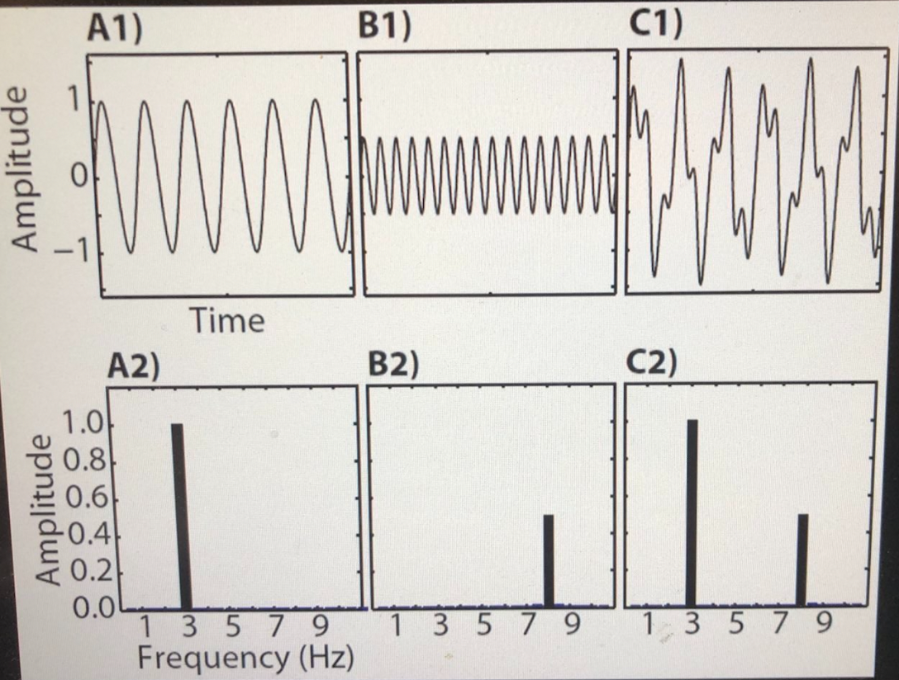
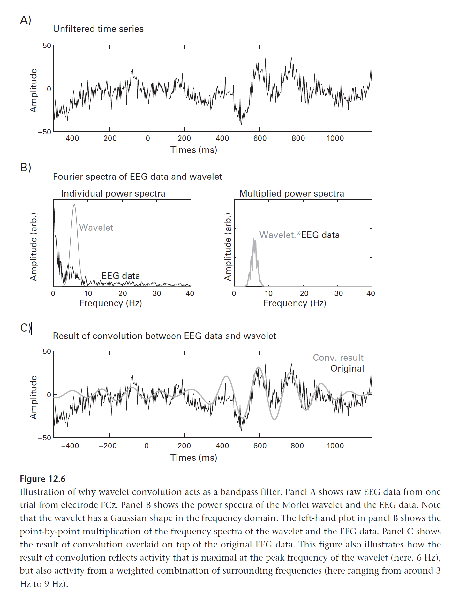

# section-1

## Amplitude and Frequency

- Amplitude: distance between the resting position and the maximum displacement of the wave.
- Frequency: number of waves passing by a specific point per second.

# section-2: time series denoising

## time series filter

if k (windows size) is very large, edge effect will be large also as data between 0 to k will be 0

### mean-smoothing

### gaussian-smoothing

- more smoother then mean-smooth
- data near windows center has more weighting
- k should be minimial as possible (to avoid edge effect) while the first item of gaussian window should be closed to 0

### electromyogram

- denoising via TKEO
- convert original signal and TKEO signal as `z score`

### median filter

- use hist to pick threshold
- compare with mean filter it preserve the detail of datas (e.g. the edge on the graph)

## data processing

### linear detrending

### nonlinear trend with polynomials (modle fitting)

- use `Bayes information criterion` to find optimal order

# section-3 spectral and rhythmicity analyses

## time domain vs frequency domain

## terms
- sampling rate: the number of samples per second (or per other unit) taken from a continuous signal to make a discrete or digital signal.

- Nyquist frequency: In units of cycles per second (Hz), its value is one-half of the sampling rate (samples per second)

## fourir transform

### convert signal from time domain to frequency domain

- some signal are better understood in the frequency doamin
- spectral analyses can reveal insights that cannot be seen in the time domain

### other goals

- frequency domain computations are often easier and faster than time domain
- use the convolution theorem to perform other operation in the frequency domain like filtering, autocorrection, etc.

### Welch's method
- divide time into different block (e.g. n time block)
- compute the frequency and power for each time block
- later can use the data to draw a spectrogram (with n time block)

# section-4: complex numbers

## Complex conjugate
In mathematics, the complex conjugate of a complex number is the number with an equal real part and an imaginary part equal in magnitude but opposite in sign. That is, the complex conjugate of `a+bi` is equal to `a-bi`

# sectoin-5: filtering

## filter time series data
1. data in time domain convert to frequency domain and cut-offs (high pass(perserve high frequency only) or low pass filtering)
2. generate filter kernel (firls, fir1, butter or other)
3. evaluate kernel and its power spectrum
4. apply filter kernel to data

## taper function
1. Hann vs Hamming vs Gauss

- Hann and Hamming are similiar, but Hann will touch `0`. So Hamming may still have edge effect.
- Gauss windows are narrower and will go quickier to `0`

## FIR vs IIR
|   | FIR  |  IIR |
|---|---|---|
| Name  | Finite impulse response  | Infinite impulse response  |
| Kernel length  | Long  | Short  |
| Speed  | Slower  | Fast (better for online/real time filtering because of short kernel length)  |
| Stability  | High  | Data-dependent  |
| Mechanism  | Multiply data with kernel  | Multiply data with data (if previous data is wired, future data may be affected)  |

## FIR
### order
The order of the filter is the number of time points in the filter. So an order-13 mean-smoothing filter has 13 points, which means that each point t in the filtered signal is the average of points t-6 to t+6. For example, variable k to be how far back/forwards to go, thus if k=6 then the order is 13.

## IIR
use 2 kernel filters. 
1. weigths for the previous values of the original signal, 
2. previous values of the already filtered signal

### Zero-phase filtering
Zero-phase filtering is a non-causal procedure, so it cannot be done in real time, only offline (or pseudo real-time, i.e., with a sufficient delay). A zero-phase filter needs to have a purely real-valued frequency response

## remove edge effect
clone the orignal signal, then add it to the start and the end of the original signal

## low-pass filtering
### FIR and IIR
1. define frequency cut-off and transition windows

### windowed sinc function
- supress faster after target frequencies
- has round shape later and flat line at the end

## narrow-band filter
- make sure the lower band and upper band have same size of transition windows

## two-stage wide-band filter
- filter as two step if one time filter cannot create a good filter

# section-6: Convolution 

A way to combine two time series (or images...)

- Signal: the "interesting" time series
- Kernel: The filter
- Convolution result: A mixture of the features of the signal and the kernel

computation convolution in frequency domain is easier than in time domain

## convolution theorem

- signal -> convolution (in time domain) -> frequency in fft == signal -> fft -> multiply signal and kernel (frequency domain)
- signal -> fft -> multiply signal and kernel (frequency domain) -> ifft (time domain) ==  signal -> convolution (in time domain)

## convolution result = dot product of data and kernel

suppose kernel lenght = 3
convolution [i] = data[i-1:i+2] dot kernel[i-1:i+2]

length of convolution result = length of data + length of kernel - 1

## using morlet wavelet as convolution filter

## Planck-taper

- different from Gaussian function, which has one peak point but Planck-taper can be defined with many peak point.
- 0<ϵ≤0.5 (determine steepness of increase and decress)

# section-7: Wavelet-analysis

Wavelets are functions that you can use to decompose signals.

## species of wavletes
1. Morlet wavelet
    1. need to normalize the filter signal manually as filtered signal. As the amplitude is hundreds time larger than the oringal one
2. Haar wavelet (could be used as edge detector in time domain, not useful in frequency domain/ specturm analysis)
    1. non negative value are on the right hand side of the Haar function, that's why the peak of Haar convolution will be on the right of Mexican function
3. Mexican wavelet
4. Difference of Gaussian (DoG) wavelet

## application of wavelets
1. filtering (fime-frequency analysis)
2. feature detection (pattern-matching)

## complex wavelet
consist with real part and imaginary part

### complex plane

- in a imag & real plane, distance from the origin is the `magnitude`
- `phase angle` = θ
- Real-valued wavelets are used for filtering, complex-valued wavelets are additionally used for time-frequency analysis (e.g., power and phase).

# section-8: Resampling
## interpolation/resampling/upsampling: insert extra points/data

## downsampling 
steps:

1. pick new sampling rate
2. low-pass filter at new Nyquist
3. downsample

## how to resample in matlab?
for example from 100 to 80 factor

first upsample to 400 by 4 then downsample to 80 by factor of 5

## interpolation
linear, next, nearest, spline (better in frequency domain as the number of sharp edges)

## extrapolation
linear vs spline/cubic (data generated will be more exaggerated when compares with linear appraoch)

## spectral interpolation
interpolation data in time domain

steps:
1. it is suggested that the windows size before and after are the same
2. convert 2 windows from time domain to frequency domain
3. create the third frequency by averaging 2 spectral
4. using linear trend to connnect 2 points smoothly (detrend mock data, and add the slope from 2 window points)
